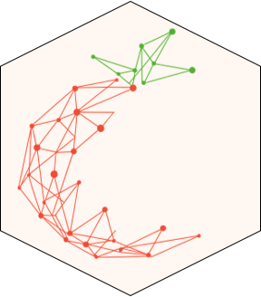

# cumba 

<!-- badges: start -->
<!-- badges: end -->

**CUMBA** (Carbon Use Model for yield and Brix Assessment) is a daily
time-step crop model for **processing tomato**. Given daily weather and
an irrigation schedule, it computes thermal time, phenology and root
growth, a three-layer soil-water balance, carbon accumulation modulated
by heat / cold / water stress, and finally predicts **fresh-fruit yield
and Brix at harvest**.

The package exposes two top-level entry points:

- `cumba_experiment()` — run the model on observed experiments using a
  user-supplied irrigation schedule (calibration mode).
- `cumba_scenario()`   — run the model in **deficit-irrigation scenario
  mode**, where irrigation is automatically triggered on phase-specific
  water-stress thresholds.

## Installation

```r
# install.packages("pak")
pak::pak("tomatoModelling/cumba_R_package")
```

## A first run

```r
library(cumba)

data(tomatoFoggia)

out <- cumba_experiment(
  weather       = tomatoFoggia$weather,
  param         = cumbaParameters,
  irrigation_df = tomatoFoggia$irrigation,
  estimateRad   = TRUE,
  estimateET0   = TRUE,
  fullOut       = FALSE
)

head(out)
```

## Documentation

- `vignette("cumba-getting-started")` — model overview and minimal example.
- `vignette("cumba-experiment")`      — running observed experiments.
- `vignette("cumba-scenario")`        — deficit-irrigation scenarios.
- `vignette("estimate_et0_rad")`      — ET0 / radiation calibration workflow.
